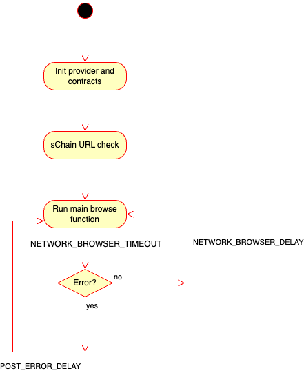
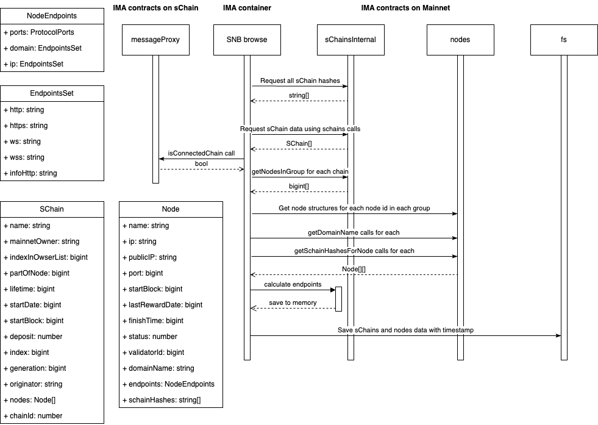

# SKALE Network Browser

## General Description

**SKALE Network Browser** (**SNB**) is part of IMA responsible for collecting data about all SKALE chains from skale-manager.
SKALE Network Browser can work as a standalone tool to browse SKALE network or work as a part of IMA agent.

- SNB is implemented as a separate module of IMA agent.
- SNB can work as a standalone tool to browse SKALE network or work as a part of IMA agent.
- SNB saves results of SKALE network scan to the specified file.
- SNB runs in an infinite loop and periodically refreshes SKALE network data.
- SNB runs as a separate process and managed by `startup.js` script.

## Architecture

### High-Level Architecture

SNB operate as an independent process within the IMA agent container, interacting with SKALE Manager and sChains to gather network information about SKALE Chains as connections between them.

In the latest version, SNB is implemented as a separate module of IMA agent and managed by `startup.js` script (see Diagram 1).

### Implementation Details

SNB runs in an endless loop - `safeNetworkBrowserLoop` and periodically refreshes SKALE network data (see Diagram 2).

It has multiple delays/timeouts that serve different purposes:

-   `POST_ERROR_DELAY` - delay before retry if error happened in browser loop (seconds, default: `5`)
-   `NETWORK_BROWSER_DELAY` - delay between iterations of the network-browser (seconds, default: `10800`)
-   `NETWORK_BROWSER_TIMEOUT` - maximum amount of time allocated to the browse function (seconds, default: `1200`)

See more details in the [network-browser README](../network-browser/README.md).

- Mainnet provider is created using `MAINNET_RPC_URL` env variable and optional `MULTICALL` env variable
- `sChainsInternal` and `nodes` contracts are created using `MANAGER_ABI_PATH` env variable
- `SCHAIN_URL` pinged in a loop to determine if local/remote skaled is running and ready to accept requests

After this, SNB starts its main loop.
On each iteration, SNB performs the following steps:

- All sChain hashes are requested from `sChainsInternal` contract
- For each sChain, its data is requested from `sChainsInternal` contract using `schains` call
- Optional step: if `CONNECTED_ONLY` env variable is set to `true`, only connected sChains are processed
- To determine if sChain is connected, sChain provider is inited using `SCHAIN_RPC_URL` env variable and `isConnectedChain` call is performed on `messageProxy` contract on local sChain
- For each chain nodes in the group are requested from `sChainsInternal` contract using `getNodesInGroup` call
- For each node id node data is requested from `nodes` contract using `nodes` call, `getNodeDomainName` call and `getSchainHashesForNode` call
- Endpoints are computed using `nodeStruct` function for each node
- Resulting data is saved to the file specified in `IMA_NETWORK_BROWSER_DATA_PATH` env variable along with the timestamp

All calls in the loops are performed using `multicall` provider if `MULTICALL` env variable is set to `true`.
See Diagram 3 for more details.

## Component Diagrams

### Diagram 1. High-Level Architecture
This diagram shows how IMA container is structured and how SNB is integrated into it:


### Diagram 2. SNB Loop
This diagram shows SNB’s browse loop:



### Diagram 3. SNB Internal Structure
This diagram shows SNB’s internal structure:



## Data format

SNB stores data in JSON format. The data is stored in the following format:

```json
{
  "updatedAt": 1703247331,
  "schains": [
    {
      "name": "chain-name",
      "mainnetOwner": "0x5cF21aeaAAA5472b9b11AE3c73A392466EeF854e",
      "indexInOwnerList": "0",
      "partOfNode": "16",
      "lifetime": "43200",
      "startDate": "1654778157",
      "startBlock": "14932629",
      "deposit": "0",
      "index": "26",
      "generation": "1",
      "originator": "0x4f7e825E1C0a42924016115897e39c9d93D04aD1",
      "chainId": 1026062157,
      "nodes": [
        {
          "name": "node-name",
          "ip": "21.83.36.61",
          "publicIP": "21.33.36.60",
          "port": "10000",
          "startBlock": "10966891",
          "lastRewardDate": "1700957519",
          "finishTime": "0",
          "status": "3",
          "validatorId": "52",
          "domainName": "test.domain.com",
          "schainHashes": [
            "0x0000073273d9f3c4e488771393160391885dfa507a20fb697be411ad3411d363",
            "0x000003d91725cdc8aab2c5aeef5e5dbee73162670abe6353e31ac4348e616d0e",
            "0x0000017723ca21de167b6735af8638d9f1d82345ec97d288f4d6918662f0a865",
            "0x000003d28774d2845ee8b9f656cc77328199a7a69b03ce2b9578f230be679c9f"
          ],
          "endpoints": {
            "ports": {
              "http": 10195,
              "https": 10200,
              "ws": 10194,
              "wss": 10199,
              "infoHttp": 10201
            },
            "domain": {
              "http": "http://test.domain.com:10195",
              "https": "https://test.domain.com:10200",
              "ws": "ws://test.domain.com:10194",
              "wss": "wss://test.domain.com:10199",
              "infoHttp": "http://test.domain.com:10201"
            },
            "ip": {
              "http": "http://11.23.36.60:10195",
              "https": "https://21.23.36.60:10200",
              "ws": "ws://11.83.26.60:10194",
              "wss": "wss://11.22.26.60:10199",
              "infoHttp": "http://11.22.36.60:10201"
            }
          }
        }
      ]
    }
  ]
}
```

In may contain either the entire SKALE network or connected chains only, depending on the configuration.

## Usage

SNB usage is fully covered in the [network-browser README](../network-browser/README.md), including required and optional environment variables, development and production modes, etc.

## Testing

SNB is covered by unit tests and also tested as a part of integration tests of ima-agent.

Unit tests in the `network-browser` works as follows:

- Local hardhat network is started locally
- `skale-manager` contracts are deployed to the local network
- Before each test, a set of nodes and sChains are created on `skale-manager`
- Tests are executed using `bun:test` framework

Units tests are located in the `network-browser/tests` folder.